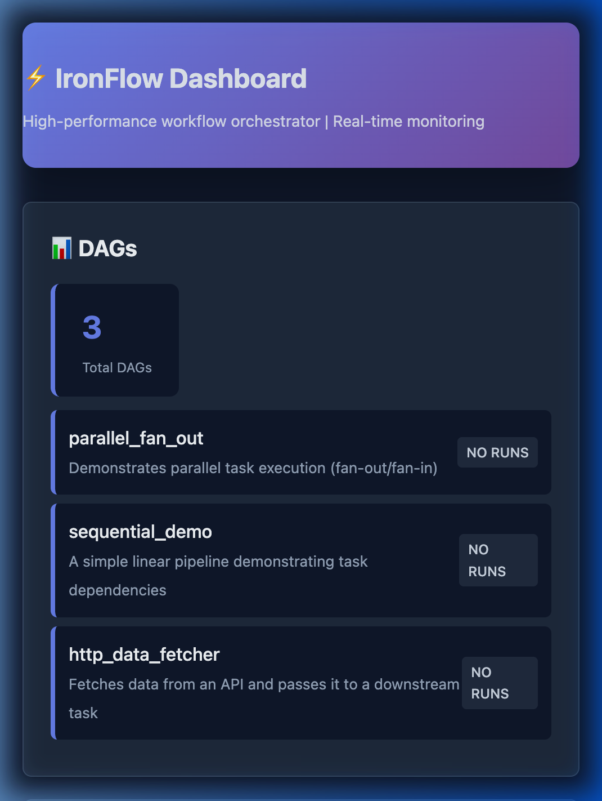
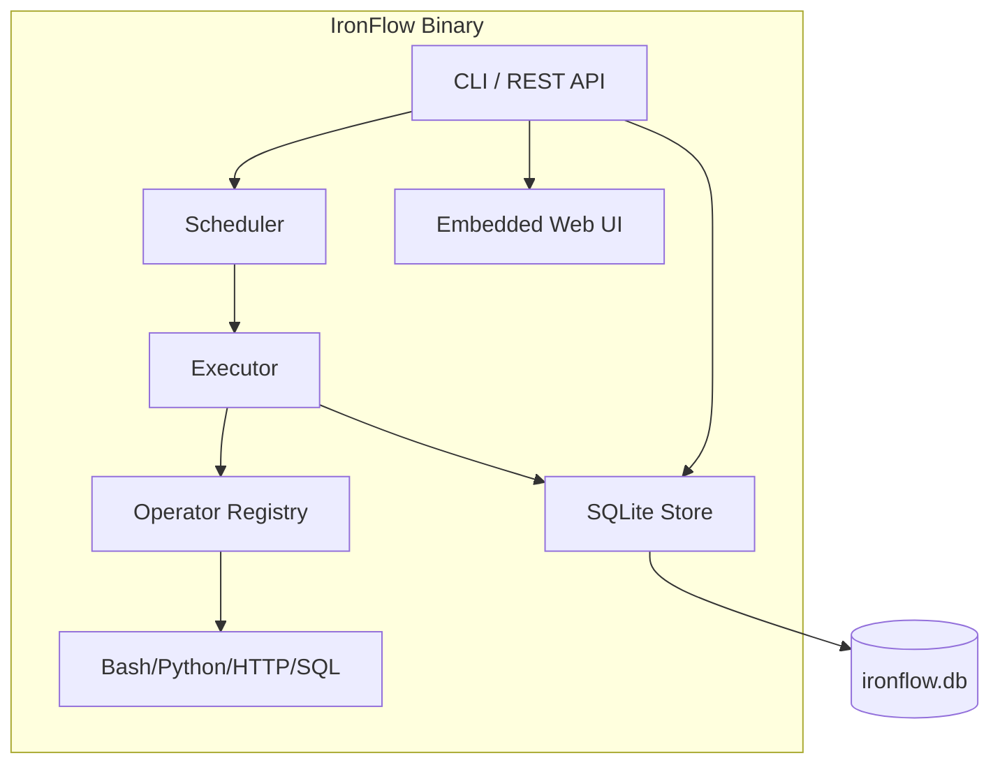

# IronFlow

> A lightning-fast, zero-dependency workflow orchestrator written in Rust.

---

## ⚡ Benchmarks

We ran a **50-task sequential pipeline** against the industry's top orchestrators — same machine, same tasks, same workload. Every competitor ran in its fastest single-process mode.

| Orchestrator | Execution Time | Peak Memory | vs. IronFlow |
|---|---|---|---|
| 🥇 **IronFlow** | **0.08s** | **12 MB** | — |
| Dagster | 1.07s | 98 MB | 13× slower |
| Prefect | 4.69s | 155 MB | 58× slower |
| Apache Airflow | 31.38s | ~380 MB | **392× slower** |

> IronFlow completed the entire 50-task pipeline — including full SQLite state persistence — in **85 milliseconds**.
> Apache Airflow took **31 seconds** for the exact same job.

Methodology, test scripts, and raw results are fully open-sourced in [`benchmarks/`](./benchmarks/METHODOLOGY.md).

---

## What Is IronFlow?

IronFlow is a **single-binary workflow orchestrator** for teams and individuals who need Airflow-grade reliability without Airflow-grade infrastructure.

No Python runtime. No Celery workers. No Redis. No PostgreSQL. One binary. One file.



```bash
# 30-second Quickstart
curl -L https://github.com/theoxfaber/ironflow/releases/latest/download/ironflow-linux-amd64 -o ironflow
chmod +x ironflow
./ironflow start --dags-dir ./examples --with-api
```

---

## 🏗 Architecture



**Storage:** Single SQLite file with WAL mode. No network, no daemon, no lock files.

**Concurrency:** All task execution is `tokio::spawn`'d — parallel tasks run concurrently within each DAG run.

**State Machine:**
```
Queued → Running → Success
                 ↘ Retried → Running → …
                 ↘ Failed
```

---

## Quick Start

### Install

**Option 1: Cargo (Recommended)**
```bash
cargo install ironflow
```

**Option 2: Prebuilt Binaries**
Download the latest binary for your OS from the [Releases](https://github.com/theoxfaber/ironflow/releases) page.

**Option 3: From Source**
```bash
git clone https://github.com/theoxfaber/ironflow
cd ironflow
cargo build --release
```

### Define a DAG

Create `dags/my_pipeline.toml`:

```toml
[dag]
id = "my_pipeline"
description = "My first IronFlow pipeline"
schedule = "0 9 * * *"  # daily at 9am

[[dag.tasks]]
id = "extract"
operator = "bash"
[dag.tasks.config]
command = "echo '{\"rows\": 1000, \"source\": \"db\"}'"

[[dag.tasks]]
id = "transform"
operator = "bash"
depends_on = ["extract"]
xcom_inputs = ["extract"]   # receive upstream JSON output
retries = 3
timeout_secs = 300
[dag.tasks.config]
command = "echo 'Transforming data...'"

[[dag.tasks]]
id = "load"
operator = "bash"
depends_on = ["transform"]
[dag.tasks.config]
command = "echo 'Loading complete'"
```

### Run

```bash
# Start scheduler + API server + Web UI
./ironflow start --dags-dir ./dags --with-api --port 8080

# Trigger manually via CLI
./ironflow trigger my_pipeline

# Open the dashboard
open http://localhost:8080
```

**Storage:** Single SQLite file with WAL mode. No network, no daemon, no lock files.

**Concurrency:** All task execution is `tokio::spawn`'d — parallel tasks run concurrently within each DAG run.

**State Machine:**
```
Queued → Running → Success
                 ↘ Retried → Running → …
                 ↘ Failed
```

---

## CLI Reference

```
ironflow start     --dags-dir <path> --db-path <path> [--with-api] [--port <n>]
ironflow serve     --port <n> --db-path <path>
ironflow trigger   <dag_id> --db-path <path>
ironflow status    <dag_id> [--limit <n>] --db-path <path>
ironflow list      --db-path <path>
ironflow pause     <dag_id> --db-path <path>
ironflow unpause   <dag_id> --db-path <path>
```

---

## REST API

```
GET  /api/dags                  List all DAGs
GET  /api/dags/:id              DAG definition + metadata
GET  /api/dags/:id/runs         Run history (last 100)
POST /api/dags/:id/trigger      Trigger a manual run (non-blocking)
GET  /api/runs/:run_id          Run status + all task states + logs
GET  /                          Web dashboard
```

---

## Operators

| Operator | Config Keys | Description |
|---|---|---|
| `bash` | `command` | Run a shell command |
| `python` | `script`, `args` | Execute a Python script |
| `http` | `url`, `method`, `body`, `headers` | Make an HTTP request |
| `sql` | `query`, `connection` | Run a SQL query |
| `slack` | `webhook_url`, `message` | Post a Slack message |

---

## Adding a Custom Operator

```rust
// src/operators/my_op.rs
use async_trait::async_trait;
use anyhow::Result;
use crate::operators::Operator;

pub struct MyOperator;

#[async_trait]
impl Operator for MyOperator {
    async fn execute(&self, config: &serde_json::Value) -> Result<String> {
        let param = config["my_param"].as_str().unwrap_or("default");
        Ok(format!("{{\"result\": \"{}\"}}", param))
    }
}
```

Register it in `src/operators/mod.rs`:
```rust
registry.insert("my_op", Box::new(MyOperator));
```

---

## Tests

```bash
cargo test
# test result: ok. 32 passed; 0 failed; 1 ignored
```

---

## When to Use IronFlow

**✅ IronFlow is ideal for:**
- Single-node deployments (developer machines, edge servers, IoT)
- Air-gapped environments with no internet connectivity
- CI/CD pipelines that need lightweight orchestration
- Teams that want zero infrastructure overhead
- Workloads with 1–100k tasks per day

**Consider Airflow/Prefect instead for:**
- Multi-tenant enterprise deployments (1000+ teams)
- Python-heavy ML pipelines needing native object passing
- Distributed execution across many worker machines

---

## Roadmap

- [x] Embedded Web Dashboard
- [x] XCom Data Passing
- [x] Crash Recovery
- [ ] WebSocket live log streaming
- [ ] Task-level metrics & SLA tracking
- [ ] Multi-user authentication & RBAC
- [ ] Distributed executor mode (PostgreSQL backend)
- [ ] Plugin registry for custom operators

---

## License

Apache 2.0 — see [LICENSE](./LICENSE).

---

## Contributing

Pull requests welcome. Please open an issue first for large changes.
